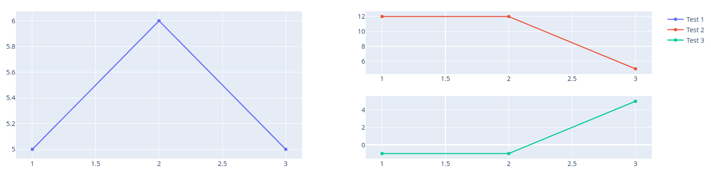

# wraplotly

A small wrapper around plotly to have easier access to some of the functions I use most when doing Data analysis.
Some examples of what wraplotly offers is given in the notebook ```examples.ipynb```.

A quick demonstration of how wraplotly handles subfigures for instance:

```python
from wraplotly.grid import Grid
from wraplotly.charts import line

grid = Grid([
    [0,1], 
    [0,2]
])

grid(line(x=[1,2,3], y=[5,6,5], name="Test 1"))
grid(line(x=[1,2,3], y=[12,12,5], name="Test 2"))
grid(line(x=[1,2,3], y=[-1,-1,5], name="Test 3"))
grid.show()
```



## Installation

```bash
pip3 install https://github.com/goncalogiga/wraplotly
```