# wraplotly

A small wrapper around [plotly](https://plotly.com/) to have easier access to some of the functions I use most when doing Data analysis.
Some examples of what wraplotly offers is given in the notebook ```examples.ipynb```.

A quick demonstration of how wraplotly handles subfigures for instance:

```python
import wraplotly as wp

grid = wp.grid([
    [0,1], 
    [0,2]
])

grid(wp.line(x=[1,2,3], y=[5,6,5], name="Test 1"))
grid(wp.line(x=[1,2,3], y=[12,12,5], name="Test 2"))
grid(wp.line(x=[1,2,3], y=[-1,-1,5], name="Test 3"))
grid.show()
```


The figure object can still be accessed with the ```fig``` proprety so the wrapper doesn't really restrain anything.
For example, the wrapper class ```colored_line``` in the next example, makes it possible to add a title to the figure:

```python
fig = wp.colored_line(dataset, x="Date", y="Cases", color="Event", mode="lines").fig
fig.update_layout(title="Covid cases in Saudi Arabia with different events colored")
fig.show()
```

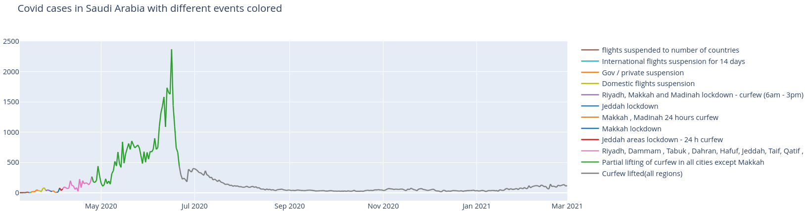

## Installation

```bash
pip3 install git+https://github.com/goncalogiga/wraplotly
```

## Full list of wraplotly wrapper functions

### Drawings

Simple line

```python
wp.line(x=[1,2,3], y=[7,5,7])
```

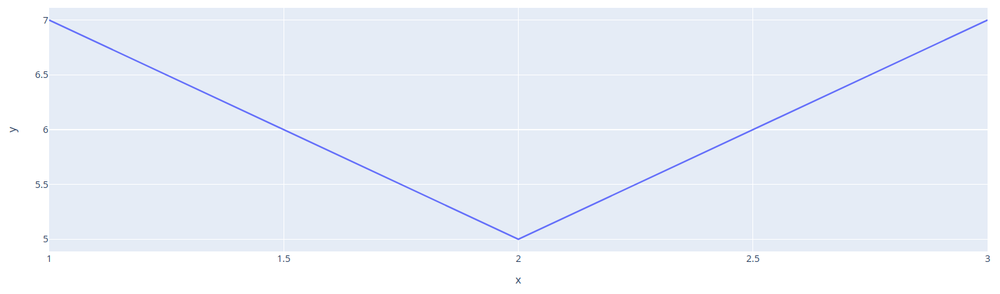

Simple line using a dataframe

```python
df = pd.DataFrame({"x": [1,2,3], "y": [10,0,10]})
wp.line(df, x='x', y='y')
```

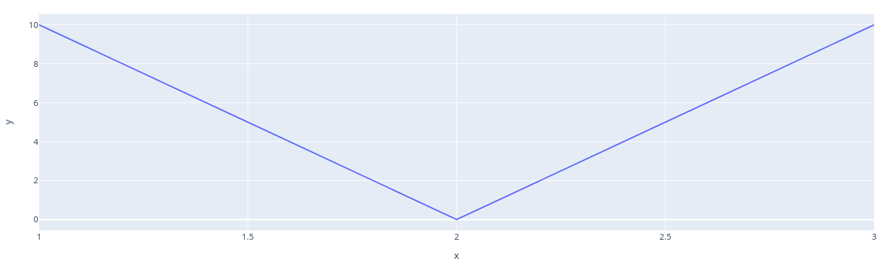

*Note*: We will now omit this 'dataframe method', but it can be used in each of the following drawing methods. Note that it is also possible to simply call ```line([1,2,3])``` to omit trivial x-axis.

Colored line

```python
x_list = [1, 2, 3, 4, 5, 6]
y_list = [5, 1, 1, 4, 1, 3]
color_list = ['Class 1', 'Class 2', 'Class 1', 'Class 2', 'Class 1', 'Class 2']
wp.colored_line(x=x_list, y=y_list, color=color_list, mode="lines")
```

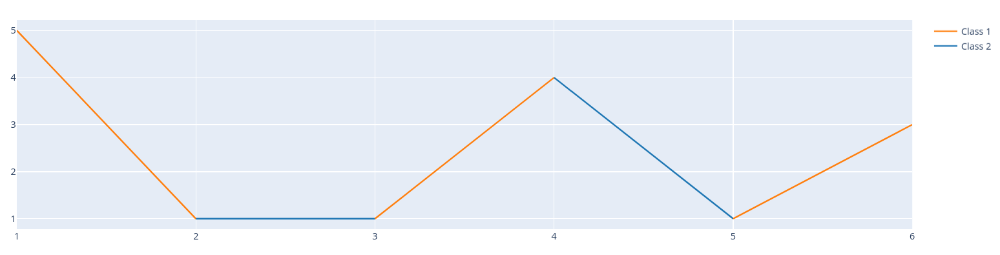

Scatter plots

```python
wp.scatter(x=[1,2,3], y=[1,2,3])
```

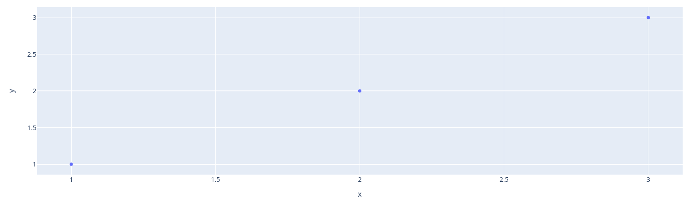

Bar plots

```python
wp.bar(x=[0,1,2], y=[6,12,5])
```

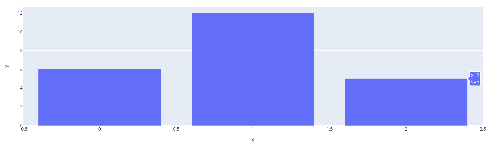

Box plots

```python
import plotly.express as px
df = px.data.tips()
wp.box(df, x="time", y="total_bill")
```

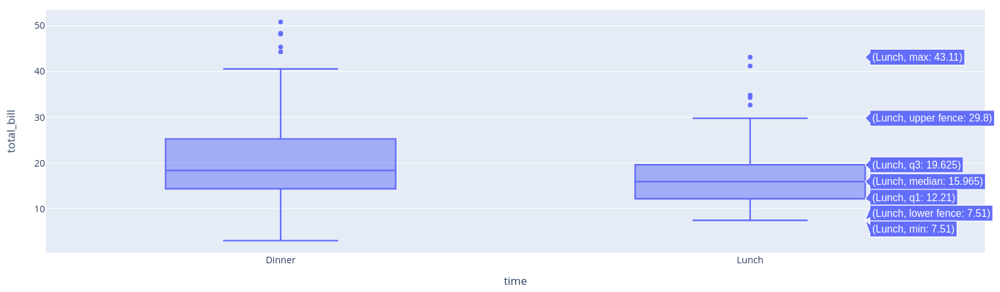

Heatmaps

```python
import plotly.express as px
df = px.data.medals_wide(indexed=True)
wp.heatmap(df)
```

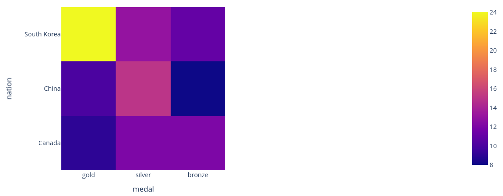

Images

```python
from skimage import io
img = io.imread('https://upload.wikimedia.org/wikipedia/commons/thumb/0/00/Crab_Nebula.jpg/240px-Crab_Nebula.jpg')
wp.imshow(img)
```

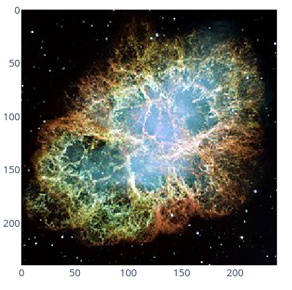

Confusion Matrix

```python
matrix = [[159, 21], [39, 75]]
labels = ['Positive', 'Negative']
wp.confusion(matrix, labels)
```

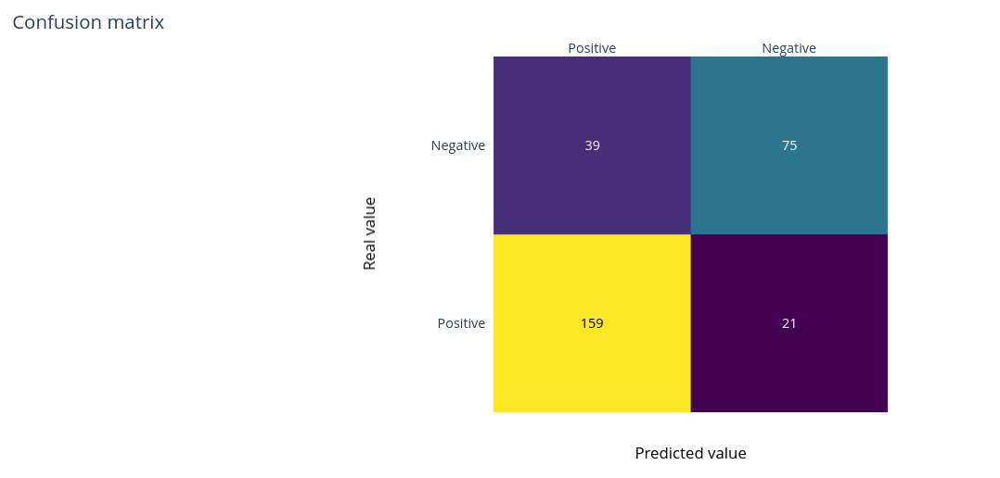

Histogram

```python
import plotly.express as px
df = px.data.tips()
wp.histogram(df, x="sex", y="total_bill", color="sex", pattern_shape="smoker")
```

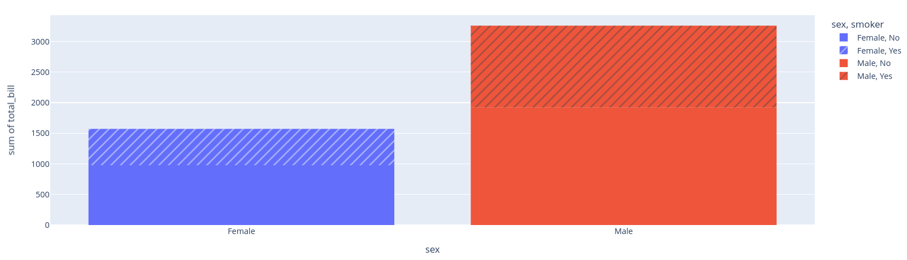

Count Plot

```python
import pandas as pd

# Some dummy dataset
df = pd.DataFrame(
    {
        "Name": ["User1", "User1", "User1", "User2"],
        "Defect severity": ["Medium", "Medium", "High", "High"],
    }
)
wp.countplot(df, x="Name", hue="Defect severity")
```

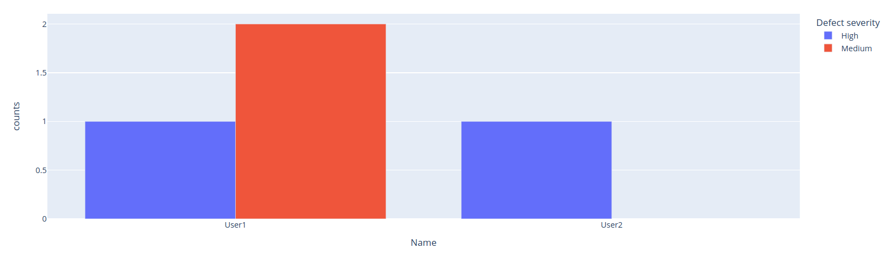


### Arranging

Horizontal stacking of figures:

```python
import plotly.express as px
df = px.data.tips()

wp.hstack( 
    wp.box(df, y="total_bill", name="Overall box plot"),
    wp.box(df, x="time", y="total_bill")
)
```

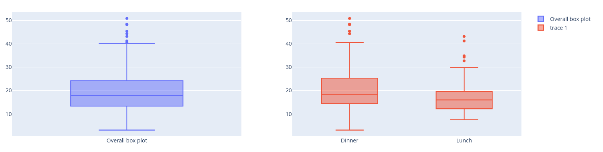

Vertical stacking of figures:

```python
wp.vstack(
    wp.line(x=[1,2,3], y=[5,6,6], mode="lines", name="1"),
    wp.line(x=[3,4,5], y=[1,1,1], mode="lines", name="2")
)
```

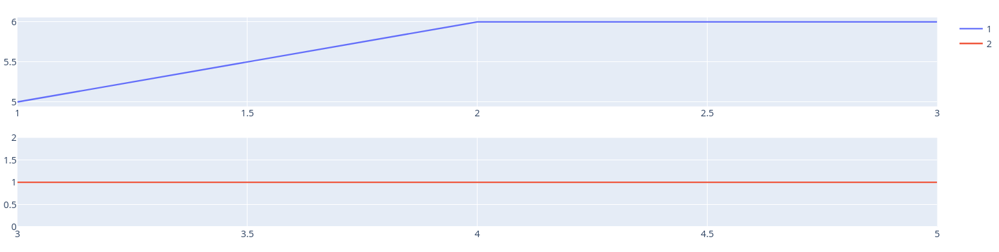

Combining figures:

```python
wp.combine(
    wp.bar(x=[0,1,2], y=[6,12,5]),
    wp.bar(x=[3,4,5], y=[10,10,10])
)
```

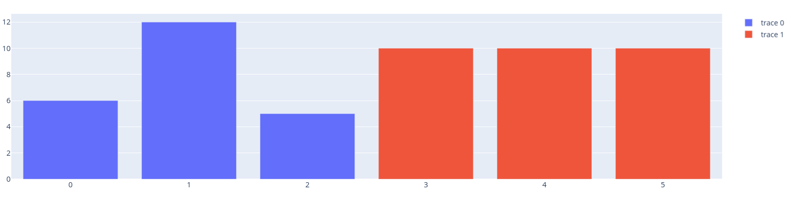

grid

```python
grid = wp.grid([
    [0,1], 
    [0,2]
])

grid(wp.line(x=[1,2,3], y=[5,6,5], name="Test 1"))
grid(wp.line(x=[1,2,3], y=[12,12,5], name="Test 2"))
grid(wp.line(x=[1,2,3], y=[-1,-1,5], name="Test 3"))
grid.show()
```


grid with the first line combined

```python
grid = wp.grid([
    [0],
    [1]
])

grid(wp.line([0,1,3], name="Combined 1"), wp.line([3,2,5], name="Combined 2"))
grid(wp.line([5,6,5], name="Bellow"))
grid.show()
```

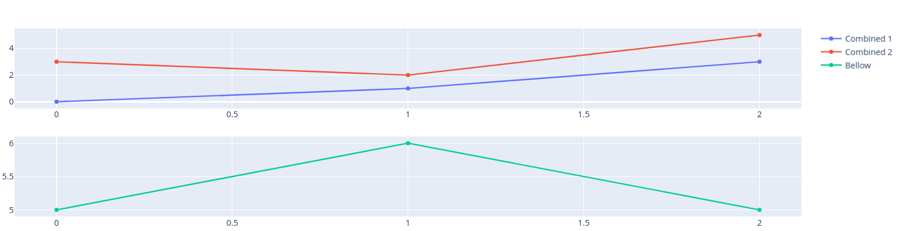

## About plotly-resampler

wraplotly uses the [plotly-resampler](https://plotly.com/) library, which solves memory issues when displaying large plots, by downsampling (aggregating) the data respective to the view and then plotting the aggregated points. This is done automaticly when the data passed to the wraplotly objects are too large. Here is an example:

```python
x = np.arange(1_000_000)
noisy_sin = (3 + np.sin(x / 200) + np.random.randn(len(x)) / 10) * x / 1_000

wp.line(noisy_sin)
```

```
/home/wraplotly/base.py:85: UserWarning:

Data was too large (~1000000) and had to be downsampled using plotly-resampler.
```

