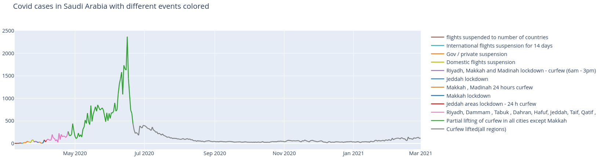

# wraplotly

A small wrapper around [plotly](https://plotly.com/) to have easier access to some of the functions I use most when doing Data analysis.
Some examples of what wraplotly offers is given in the notebook ```examples.ipynb```.

A quick demonstration of how wraplotly handles subfigures for instance:

```python
from wraplotly.grid import Grid
from wraplotly.charts import line

grid = Grid([
    [0,1], 
    [0,2]
])

grid(line(x=[1,2,3], y=[5,6,5], name="Test 1"))
grid(line(x=[1,2,3], y=[12,12,5], name="Test 2"))
grid(line(x=[1,2,3], y=[-1,-1,5], name="Test 3"))
grid.show()
```


The figure object can still be accessed with the ```fig``` proprety so the wrapper doesn't really restrain anything.
For example, the wrapper class ```colored_line``` in the next example, makes it possible to add a title to the figure:

```python
fig = colored_line(dataset, x="Date", y="Cases", color="Event", mode="lines").fig
fig.update_layout(title="Covid cases in Saudi Arabia with different events colored")
fig.show()
```




## Installation

```bash
pip3 install git+https://github.com/goncalogiga/wraplotly
```