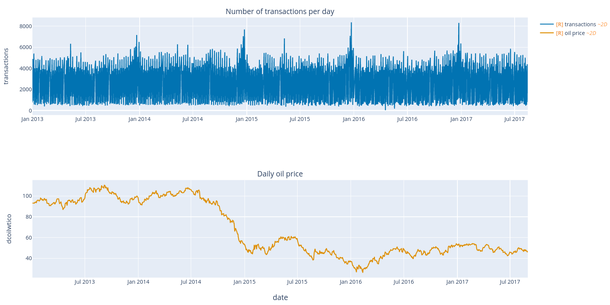
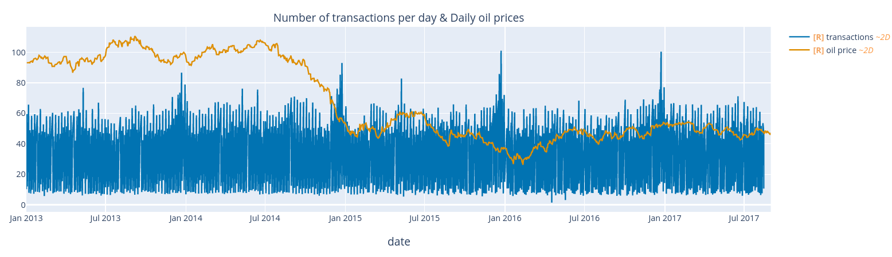
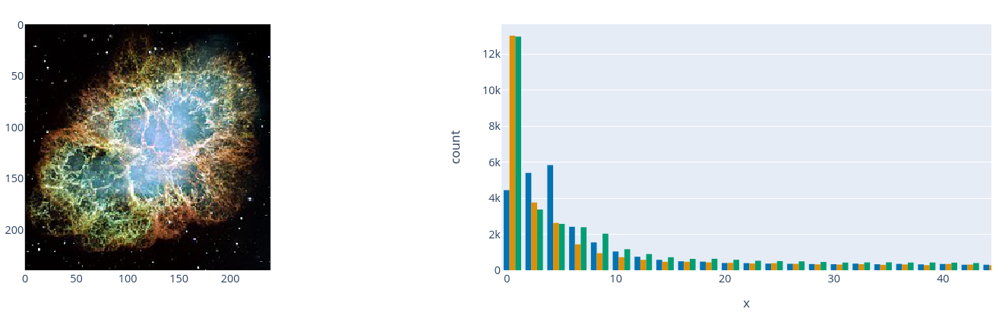
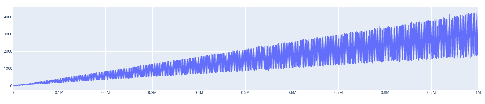

# wraplotly

wraplotly is a small wrapper around [plotly](https://plotly.com/) built to:

* Making it easier to create subplots by using wrappers containg both the plotly express and the graph objects (sometimes ever figure factory).
* Automaticly resample scatter plots that contain too much information using the [plotly-resampler](https://github.com/predict-idlab/plotly-resampler) library.
* Add some data analysis related functionalities to plotly.

A quick demonstration of how wraplotly handles subfigures for instance:

```python
import wraplotly as wp
from sklearn import datasets
from sklearn.cluster import AgglomerativeClustering

n_samples = 500
points, _ = datasets.make_circles(n_samples=n_samples, factor=0.5, noise=0.05)
x, y = points[:, 0], points[:, 1]

c_single = AgglomerativeClustering(linkage="single").fit(points).labels_
c_average = AgglomerativeClustering(linkage="average").fit(points).labels_
c_complete = AgglomerativeClustering(linkage="complete").fit(points).labels_
c_ward = AgglomerativeClustering(linkage="ward").fit(points).labels_

grid = wp.grid([[0, 1, 2, 3]], subplot_titles=["Single", "Average", "Complete", "Ward"])

grid(wp.scatter(x, y, color=c_single))
grid(wp.scatter(x, y, color=c_average))
grid(wp.scatter(x, y, color=c_complete))
grid(wp.scatter(x, y, color=c_ward))

fig = grid.fig
fig = fig.update_layout(title="Different linkage impacting the agglomerative clustering of a circle")
fig.show()
```


There is also a built-in function to stack figures horizontaly:

```python
hstack = wp.hstack(
    wp.scatter(x, y, color=c_single),
    wp.scatter(x, y, color=c_average),
    wp.scatter(x, y, color=c_complete),
    wp.scatter(x, y, color=c_ward),
    subplot_titles=["Single", "Average", "Complete", "Ward"],
)

fig = hstack.fig
fig = fig.update_layout(title="Different linkage impacting the agglomerative clustering of a circle")
fig.show()
```

## Installation

```bash
pip3 install git+https://github.com/goncalogiga/wraplotly
```

## Other arragements

Aside from the ```grid``` and the ```hstack``` methods, it is also possible to use vertical stacking (```vstack```) and combination of plots (```combine```)

### Vertical stacking

```python
oil = pd.read_csv("/kaggle/input/store-sales-time-series-forecasting/oil.csv")
transactions = pd.read_csv("/kaggle/input/store-sales-time-series-forecasting/transactions.csv")

oil['date'] = pd.to_datetime(oil['date'], format = "%Y-%m-%d")
transactions['date'] = pd.to_datetime(transactions['date'], format = "%Y-%m-%d")

stack = wp.vstack(
    wp.line(transactions, "date", "transactions", name="transactions"),
    wp.line(oil, x="date", y="dcoilwtico", name="oil price"),
    subplot_titles=["Number of transactions per day", "Daily oil price"]
)

fig = stack.fig
fig = fig.update_layout(height=750)
fig.show()
```




### Combining

```python
oil = pd.read_csv("/kaggle/input/store-sales-time-series-forecasting/oil.csv")
transactions = pd.read_csv("/kaggle/input/store-sales-time-series-forecasting/transactions.csv")

oil['date'] = pd.to_datetime(oil['date'], format = "%Y-%m-%d")
transactions['date'] = pd.to_datetime(transactions['date'], format = "%Y-%m-%d")

transactions["transactions"] = 1 + transactions["transactions"] / transactions["transactions"].max() * 100

wp.combine(
    wp.line(transactions, "date", "transactions", name="transactions"),
    wp.line(oil, x="date", y="dcoilwtico", name="oil price"),
    subplot_titles=["Number of transactions per day & Daily oil prices"]
)
```



<!-- It is also possible to combine objects inside of a grid arragement by including multiple arguments in the grid call:

```python
from skimage import io
import wraplotly as wp
img = io.imread('https://upload.wikimedia.org/wikipedia/commons/thumb/0/00/Crab_Nebula.jpg/240px-Crab_Nebula.jpg')

grid = wp.grid([
    [0,1],
    [0,1],
])

red_channel   = img[:, :, 0].flatten()
green_channel = img[:, :, 1].flatten()
blue_channel  = img[:, :, 2].flatten()

grid(wp.imshow(img))
grid(wp.histogram(x=red_channel), wp.histogram(x=green_channel), wp.histogram(x=blue_channel))
grid.show()
```

 -->

## Full list of wraplotly wrapper functions

|Definition|Inspired By|Supports arragements (grid, hstack ect.)|
| -------- | --------- | -------------------------------------- |
|```line```| px.line & go.Scatter | Yes |
|```scatter```| px.scatter & go.Scatter | Yes |
|```bar```| px.bar & go.Bar | Yes |
|```box```| px.box & go.Box | Yes |
|```histogram```| px.histogram & go.Histogram | Yes |
|```imshow```| px.imshow & go.Image | Yes |
|```heatmap``` | sns.heatmap | No |
|```distplot```| sns.distplot | No |
|```pairplot```| sns.pairplot | No |
|```colored_line```| px.scatter | No


## About plotly-resampler

wraplotly uses the [plotly-resampler](https://github.com/predict-idlab/plotly-resampler) library, which solves memory issues when displaying large plots, by downsampling (aggregating) the data respective to the view and then plotting the aggregated points. This is done automaticly when the data passed to the wraplotly objects is too large. Here is an example:

```python
x = np.arange(1_000_000)
noisy_sin = (3 + np.sin(x / 200) + np.random.randn(len(x)) / 10) * x / 1_000

wp.line(noisy_sin)
```

```
/home/wraplotly/base.py:85: UserWarning:

Data was too large (~1000000) and had to be downsampled using plotly-resampler.
```

